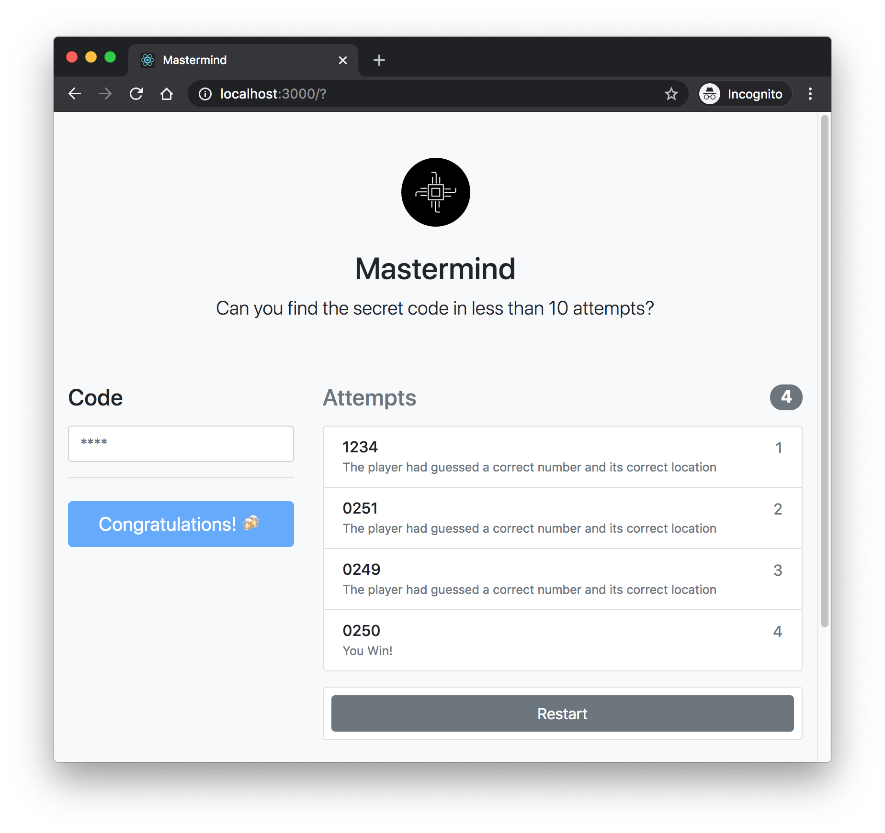

# Mastermind Game (React)

This is an implementation of a mastermind game, which can be played by a user "against" the computer. 
This is a game where a player tries to guess the number combinations. At the end of each attempt to guess the 
4 number combinations, the computer will provide feedback whether the player had guess a number correctly, or/and 
a number and digit correctly. A player must guess the right number combinations within 10 attempts to win the game.

#### [Demo](https://ludaires-mastermind.herokuapp.com/)

## Getting Started

### Prerequisites

1. Git
1. Node: any 8.x version starting with 8.4.0 or greater
1. Yarn: See [Yarn website for installation instructions](https://yarnpkg.com/lang/en/docs/install/)
1. A fork of the repo (for any contributions)
1. A clone of the [reactjs.org repo](https://github.com/reactjs/reactjs.org) on your local machine

### Installation

1. `cd mastermind-react` to go into the project root
1. `yarn` to install the website's npm dependencies

### Running locally

1. `yarn start` to start the hot-reloading development server
1. `open http://localhost:3000` to open the site in your favorite browser

Runs the app in the development mode. 
Open [http://localhost:3000](http://localhost:3000) to view it in the browser.

The page will reload if you make edits. 
You will also see any lint errors in the console.

### Testing

1. `yarn test` from the project root.

It launches the test runner in the interactive watch mode. 
See the section about [running tests](https://facebook.github.io/create-react-app/docs/running-tests) for more information.
